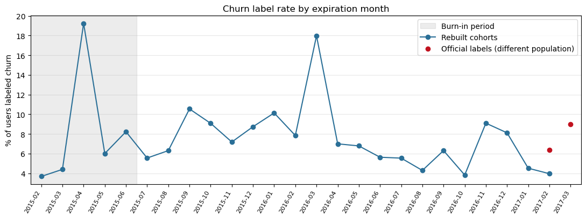

# KKBox Subscription Retention Analytics

An end-to-end retention case study on the [WSDM – KKBox Churn Prediction Challenge](https://www.kaggle.com/competitions/kkbox-churn-prediction-challenge) data: from a full-data quality audit to a defensible retention decision.

**Question:** Which behavioral signals appear before a KKBox subscriber churns, how early do they appear, and whom should be prioritized for intervention at a limited operational capacity?

## Business scenario and decision

**Scenario (hypothetical).** A subscription music service sees renewals slip. Its retention team can contact only a fraction of the subscribers whose membership expires each month, with a renewal reminder, a payment fix, or an offer. The data is real (KKBox, 2017); the team, its capacity, and any costs are assumptions made for this case study.

**Decision.** Which expiring subscribers should the team contact first, how early can they be identified, and what action should be tested?

**Constraint: capacity K**, the share of each month's expiring subscribers the team can reach. The real capacity is unknown, so the analysis will report **K = 5%, 10%, and 20%**. For reference, in the March 2017 window (970,960 labeled users, 87,330 churn labels) a randomly chosen list reaches only K% of the churners: about 4,367 at 5%, 8,733 at 10%, and 17,466 at 20%. A useful model must beat this at the same K.

**Timeline.** Predict at the end of the month before the expiry month, act during the expiry month, and learn the outcome 30 days after expiry. The lead time therefore ranges from a day to about a month depending on the expiry day. The prediction cutoff is supported by a first check against the official labels (exploratory).

**Action to test (hypothesis).** Contact the top K% by predicted risk with a reminder or offer and keep a random holdout. Primary metric: renewal within 30 days of expiry. Guardrails: cost per retained subscriber, unsubscribe and complaint rates. Risk is not the same as responsiveness, so the first experiment can randomize within risk bands.

**How it will be judged.** Not by accuracy, which is about 91% for a list that predicts nobody churns, but by precision, recall, and lift at K on later months, plus calibration, with time-ordered validation.

**What it will not claim.** No causal lift and no financial return without observed experimental evidence; any scenario estimate states its assumptions. The prediction and experiment parts are planned (Stages E and F), not done.

## Status

The first stage, a **full-data audit of both data releases (about 444 million rows)**, is complete. Later stages are planned and are not implemented yet.

| Stage | Work | Status |
|---|---|---|
| A. Audit and definitions | Audit of all source files, issue register, churn definition, label rebuild, monthly cohorts, cutoffs and feature windows | **Audit and label check complete; monthly cohorts built**; feature windows next |
| B. Relational analytics | PostgreSQL, metric definitions, cohort retention and renewal SQL | Planned |
| C. Behavioral features | `user_logs` to user-by-cutoff features (Databricks / PySpark) | Planned |
| D. Serving and BI | Snowflake marts and a Power BI dashboard | Planned |
| E. Prediction | Baseline plus one stronger model with time-aware validation, top-k evaluation | Planned |
| F. Recommendations | Intervention hypotheses, experiment design, final case study | Planned |

Each tool is introduced only when the work needs it: Python and pandas for analysis, **DuckDB and Parquet** to audit the 392-million-row listening logs on a laptop, and later PostgreSQL for relational modeling, Databricks / PySpark for the large behavioral workload, Snowflake to serve curated marts, and Power BI for executive retention monitoring.

## What the audit found

All figures are full-data results (every row), reproduced in [the audit notebook](notebooks/01_data_audit.ipynb) and summarized in [the audit report](reports/data_audit.md).

- **The "v2" files are not simple refreshes.** The v2 listening logs hold March 2017 only; the v2 transactions hold March plus 361,187 earlier rows that look like a supplement to v1. Neither release alone is a complete history, so the releases are combined through views with a `release` column and no row is dropped.
- **Two label windows, two churn rates.** The training labels cover different expiration months: 6.39% churn labels in `train.csv` and 8.99% in `train_v2.csv`. They are never pooled, and 881,701 users appear in both windows, which matters for validation design.
- **Cancellation is not churn.** The official description notes that a user can cancel to change plans and still renew, and in the first transaction release 17.18% of cancellation rows carry an expiration date earlier than their own transaction date. Churn therefore follows the official 30-day renewal rule on a reconstructed expiration, not a flag ([definition](docs/churn_definition.md)).
- **Profile data is sparse.** 65% of members have no gender, 67% have an age of zero, and about 11–12% of labeled users have no member profile. Users without a profile have a lower label rate (5.35% against 9.46% in `train_v2`), so dropping them would change the population.
- **Behavior data has gaps and impossible values.** About 12% of labeled and test users have no listening log at all, and `total_secs` contains negative and absurdly large values (up to about 9.2 quadrillion seconds) in roughly 0.05% of rows, enough to ruin any sum or average.

Nineteen data-quality items are tracked in the [issue register](reports/data_quality_issues.md) with evidence, risk, and a planned treatment. **No treatment has been applied yet**; source data is never modified.

## Churn over time

Applying the official labeller rules month by month rebuilds 25 monthly cohorts (expirations from February 2015 to February 2017). For the two supplied windows the rebuild reproduces the official labels for 98.4% (February 2017) and 95.7% (March 2017) of the users present in both, which also confirms the expiration month each label file covers. Details: [population and churn notebook](notebooks/02_population_and_churn.ipynb).



- **Churn is not flat.** The rebuilt churn label rate swings between 3.7% and 19.2%, mostly because of batches of users who share one expiration day: 92,575 users expired on 30 April 2015 and 79.8% of them were labeled churn, in a cohort with far more zero-price plans (15.3% against 0.0% a month earlier). This looks like a campaign or trial cohort (hypothesis; the cause is not in the data).
- **Rebuilt and official rates are different populations.** The rebuilt rate is lower (3.95% against 6.39% for February 2017) because the official sample includes users that the demonstration rule leaves out and marks more users as churn, many of them early renewers (the reason is an open question). The two must not be compared directly.
- **Labels can only be rebuilt up to February 2017.** Transactions end on 31 March 2017, so April renewals are invisible; March 2017 uses the official labels.

## Data

The data belongs to the Kaggle competition and is **not included in this repository**. To reproduce the audit:

1. Accept the competition rules and download the files from Kaggle into `data/raw/` (about 34 GB uncompressed; `user_logs.csv` alone is 30.5 GB).
2. Convert the two user-log files to text-typed Parquet with a row-count check:
   ```bash
   python src/csv_to_parquet.py <path>/user_logs.csv <path>/user_logs_v2.csv --out-dir <parquet folder>
   ```
3. Copy `local_settings.example.py` to `local_settings.py` and set the Parquet and scratch folders for your machine.
4. Run `notebooks/01_data_audit.ipynb` from the `notebooks/` directory (the log sections scan about 410 million rows and take minutes), then `notebooks/02_population_and_churn.ipynb` (a few minutes the first time; results are cached in the git-ignored `data/processed/`).

```bash
pip install -r requirements.txt
python -m unittest tests.test_audit_checks tests.test_audit_display tests.test_churn_labels
```

## Repository

| Path | Contents |
|---|---|
| `notebooks/01_data_audit.ipynb` | The full-data audit, with a release map, findings by table, and decisions |
| `notebooks/02_population_and_churn.ipynb` | Label rebuild against the official labels, population differences, monthly cohorts and their swings |
| `src/audit_checks.py` | Reusable DuckDB checks: row counts, missingness, key uniqueness, ranges, date validity, coverage |
| `src/churn_labels.py` | The official labeller rules rebuilt in DuckDB (population and 30-day renewal label), tested on the official examples |
| `src/audit_display.py`, `src/csv_to_parquet.py` | Readable notebook output; verified CSV-to-Parquet conversion |
| `tests/` | Unit tests for the checks and the display helper |
| `reports/` | Audit report, the data-quality issue register, and the figures used above |
| `docs/` | Data dictionary, churn definition, notes on the official dataset description |
| `KKBOX_MASTER_PLAN.md` | Scope, roadmap, decisions, and a dated log of every milestone |

## Churn definition

A subscriber churns when no new valid subscription starts within 30 days after their **effective membership expiration**; a gap of less than 30 days counts as renewal. Effective expiration is reconstructed from ordered transactions, because cancellations and plan changes can shorten or extend a membership. The competition's `WSDMChurnLabeller.scala` is the reference for label generation; its demonstration dates must be aligned with each data release. See [Churn Definition and Label Reconstruction](docs/churn_definition.md).

## Approach and limits

- Every number is labeled as a full-data result, a documented claim, or a hypothesis; the label windows (February and March 2017) are taken from the official description and are not yet verified from the transactions.
- Findings are descriptive. Historical associations do not establish that an intervention would work; any retention action is a hypothesis to be tested with a randomized experiment.
- The data is a 2017 snapshot of one subscription service, so results describe this dataset and are not a claim about subscription businesses in general.
- Predicted churn risk will be kept separate from the likelihood of responding to an intervention.
