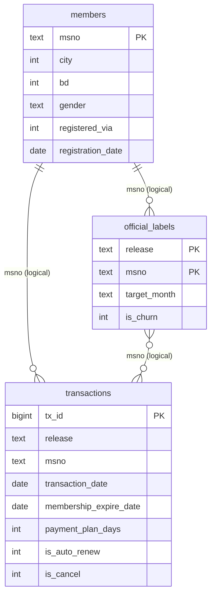

# Data model: PostgreSQL schemas and tables

Status: built and reconciled with the full-data audit (`sql/quality/01_reconcile_postgres.sql`, every check OK). Scripts: `sql/postgres/` (run with `sql/postgres/run_all.sh`).

## Schemas

| Schema | Purpose | Tables | Size |
|---|---|---|---|
| `staging` | Source files as loaded: every column is text, no value changed. Kept for reproducibility and reconciliation | `train_v1`, `train_v2`, `members_v3`, `transactions_v1`, `transactions_v2` | about 3.3 GB |
| `analytics` | Typed tables with keys, checks, and indexes, used for analysis | `members`, `official_labels`, `transactions` | about 6.4 GB |
| `public` | PostgreSQL default schema; not used | none | 0 |

`user_logs` (about 410 million rows) is **not** loaded: it stays in Parquet and is processed with DuckDB, later PySpark. Only user-by-month summaries will be loaded.

## Logical model

The three analytics tables are linked by the user key `msno`. There are **no foreign keys**, by design: not every user exists in every table, and the project does not drop unmatched records to force integrity. The diagram therefore shows logical links only (which is also why the pgAdmin ERD tool draws no lines).

Grain: `members` one row per member; `official_labels` one row per user and release (target month 2017-02 for `v1`, 2017-03 for `v2`); `transactions` one row per transaction, both releases stacked with a `release` column and no de-duplication.

## How well the keys link (full data)

| Link | Matched | Share |
|---|---|---|
| Users in `transactions` found in `members` | 1,988,333 of 2,426,143 | 81.95% |
| Users in `official_labels` found in `members` | 961,431 of 1,082,190 | 88.84% |
| Users in `official_labels` found in `transactions` | all | 100% |

Consequences: join `members` with a **left join** from labels or transactions (an inner join would remove 11–18% of users and change the population), and treat a missing profile explicitly in features. Users without a profile have a lower churn label rate (audit report).
